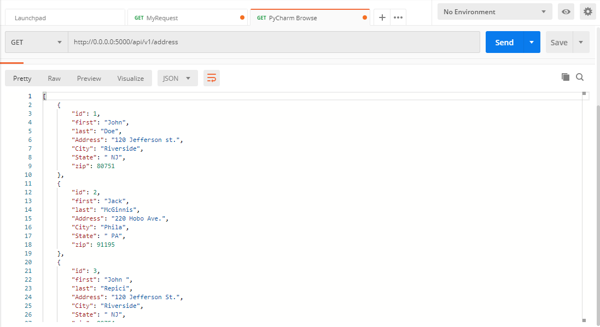
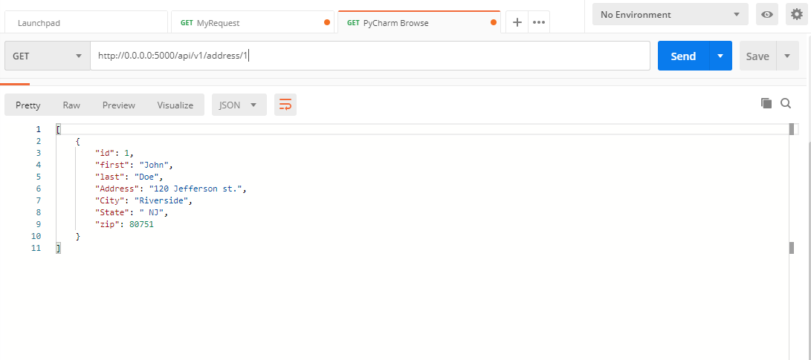
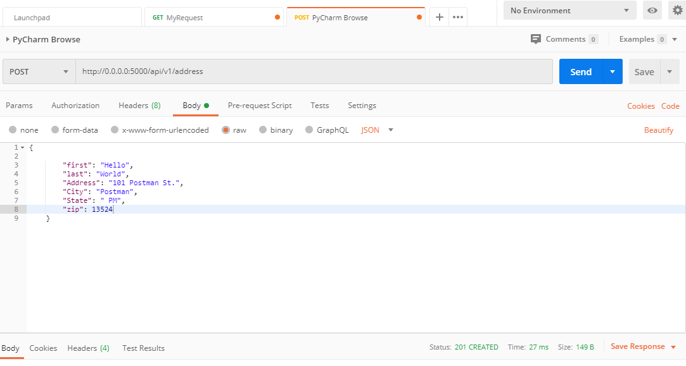
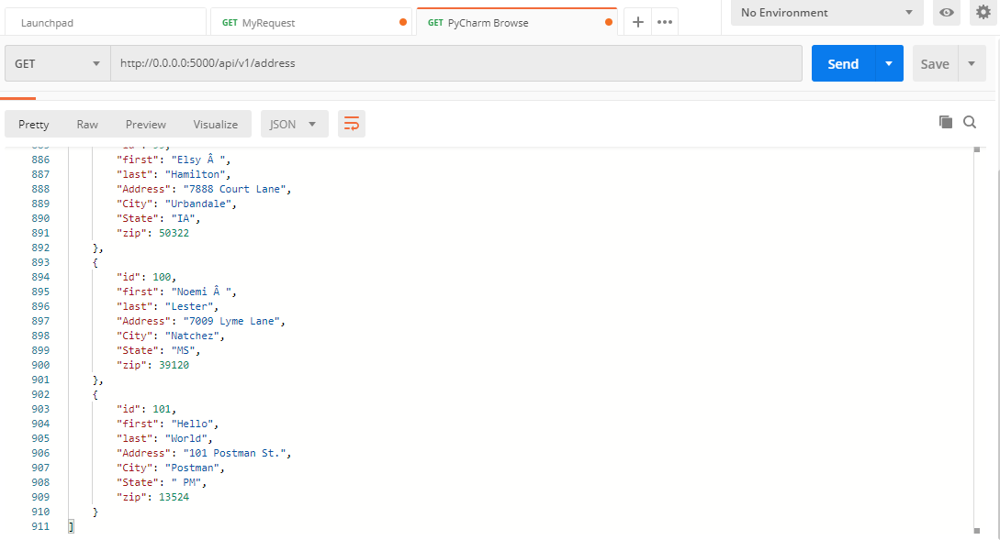
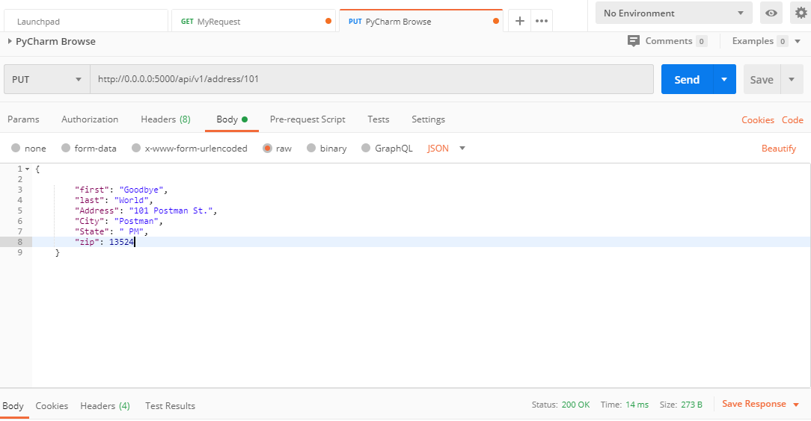
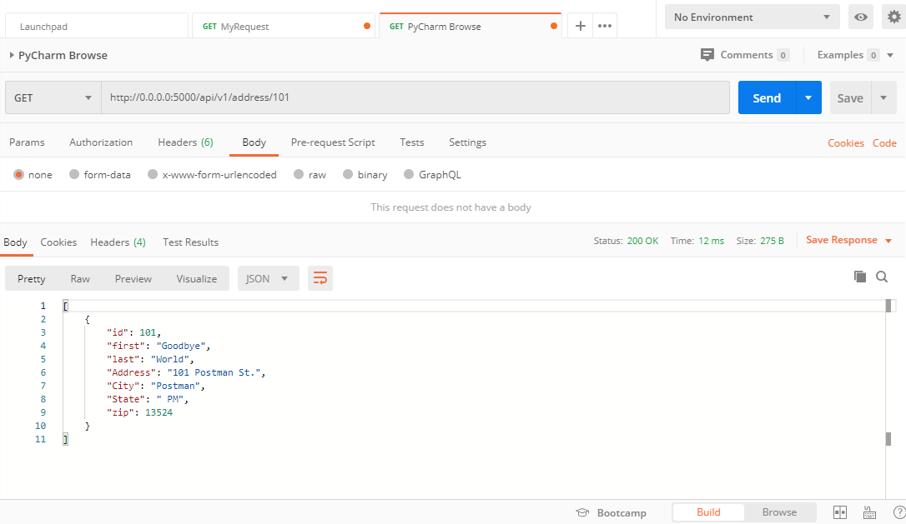
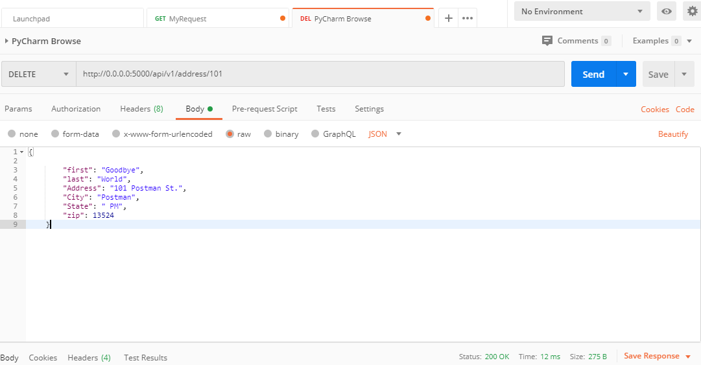
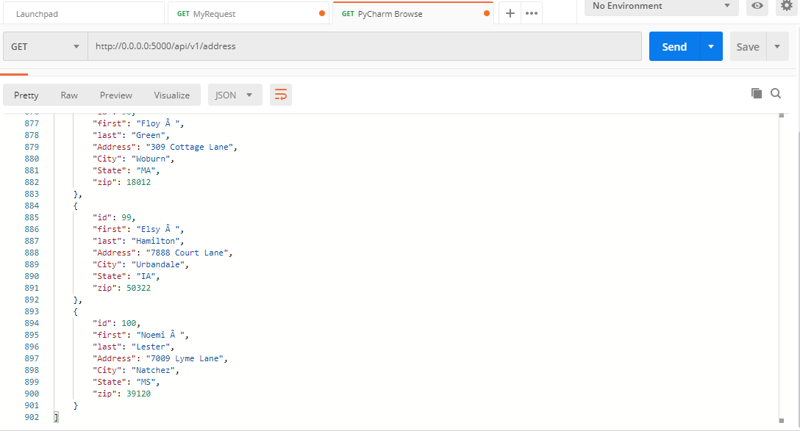

# IS218 FINAL PROJECT
## Project Description
This project is a homework assignment to that shows how to set up a structured
 database using Docker, Flask, MySQL, and Postman. 

# Browser/Database Screenshots

# Postman Screenshots
 ## Postman Records Screenshot

## Postman GET Screenshot

## Postman POST Screenshot

## Postman PUT Screenshot

 ## Postman DELETE Screenshot

